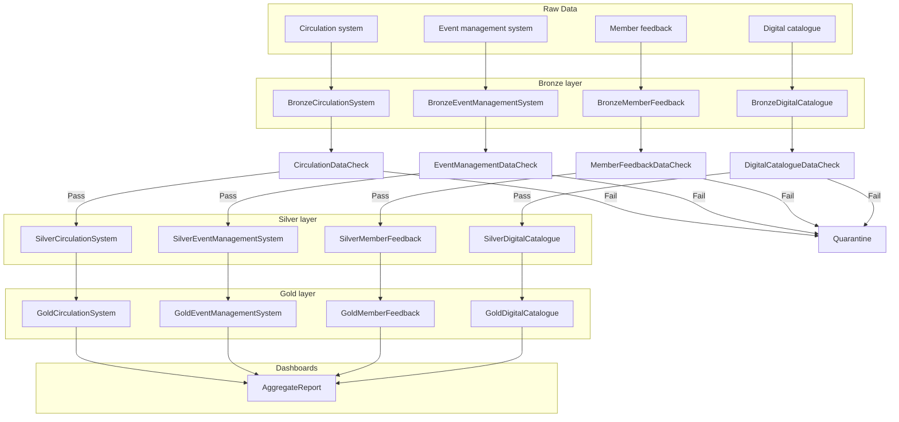

# Pipeline Architecture Diagram
## Diagram

```mermaid
flowchart TD
    subgraph Raw["Raw Data"]
        
        Circulation[Circulation system]
        EventManagement[Event management system]
        Feedback[Member feedback]
        Catalogue[Digital catalogue]
        
    end
    
    Circulation --> BronzeCirculation
    EventManagement --> BronzeEventManagement
    Feedback --> BronzeFeedback
    Catalogue --> BronzeCatalogue
    
    subgraph Bronze["Bronze layer"]
    
        BronzeCirculation[BronzeCirculationSystem]
        BronzeEventManagement[BronzeEventManagementSystem]
        BronzeFeedback[BronzeMemberFeedback]
        BronzeCatalogue[BronzeDigitalCatalogue]
        
    end
    BronzeCirculation --> CirculationDataCheck
    CirculationDataCheck -->|Pass| SilverCirculation[Silver]
    CirculationDataCheck -->|Fail| Quarantine[Quarantine]
    
    BronzeEventManagement --> EventManagementDataCheck
    EventManagementDataCheck -->|Pass| SilverEventManagement[Silver]
    EventManagementDataCheck -->|Fail| Quarantine[Quarantine]
    
    BronzeFeedback --> MemberFeedbackDataCheck
    MemberFeedbackDataCheck -->|Pass| SilverFeedback[Silver]
    MemberFeedbackDataCheck -->|Fail| Quarantine[Quarantine]
    
    BronzeCatalogue --> DigitalCatalogueDataCheck
    DigitalCatalogueDataCheck -->|Pass| SilverCatalogue[Silver]
    DigitalCatalogueDataCheck -->|Fail| Quarantine[Quarantine]

    subgraph Silver["Silver layer"]
        SilverCirculation[SilverCirculationSystem]
        SilverEventManagement[SilverEventManagementSystem]
        SilverFeedback[SilverMemberFeedback]
        SilverCatalogue[SilverDigitalCatalogue]
    end
    
    SilverCirculation -->GoldCirculation
    SilverEventManagement --> GoldEventManagement
    SilverFeedback --> GoldFeedback
    SilverCatalogue --> GoldCatalogue
    
    subgraph Gold["Gold layer"]
        GoldCirculation[GoldCirculationSystem]
        GoldEventManagement[GoldEventManagementSystem]
        GoldFeedback[GoldMemberFeedback]
        GoldCatalogue[GoldDigitalCatalogue]
    end
    
    GoldCirculation --> AggregateReport
    GoldEventManagement --> AggregateReport
    GoldFeedback --> AggregateReport
    GoldCatalogue --> AggregateReport
    
    subgraph Dashboard["Dashboards"]
        AggregateReport[AggregateReport]
    end
        
     

```
